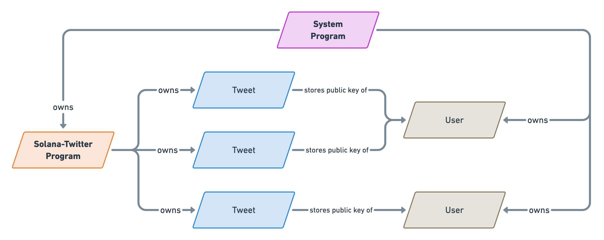
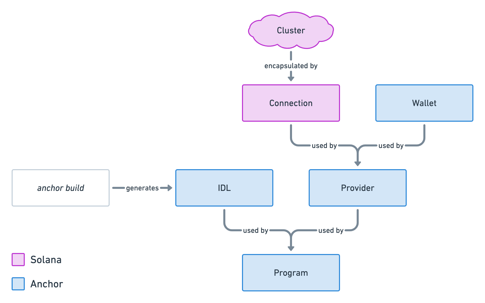
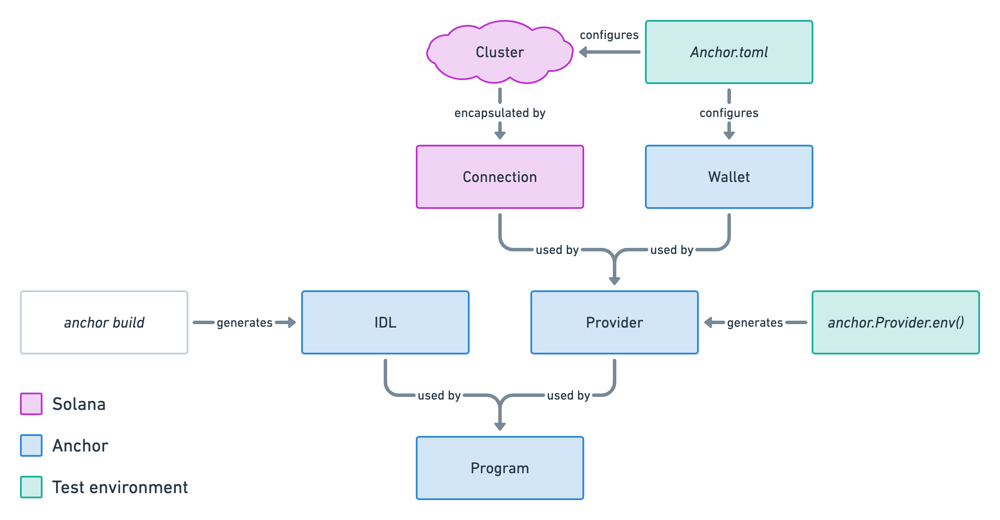

#### Here's a quiick overview of the features it will have:
- it will be able to integrate with any of the solana wallets supported by Solana Wallet Adapter
- Users will connect their wallet to login to the application
- Logged in users will be able to send tweets upto 280 Characters
- They will also be able to add an optional "topic" field to help search for tweets
- Users will be able to read tweets without needing to be logged in
- users wiill be able to view all tweets (from everyone) or filter their search by author or topics

#### Regarding this implementation:
- tweets will be stored as their own Solana Account, therefore, making them public on the blockchain
- When sending new tweets, users will pay for the transaction and the storage required to hold their tweet on the blockchain.
- we'll use the Anchor's Framework
- We'll make RPC calls to the Solana blockchain - via Anchor's Javascript Library - to fetch and filter tweets on the blockchain

1. `anchor init solana-twitter`
Inside the directory, Anchor prepared a bunch of things for us:
- A `programs` folder for all our Solana programs. It already comes with a very simple program we can build upon so we don't have to do all the scaffolding.
- A `tests` folder for all our JavaScript tests directly interacting withour programs. Again, it already comes with a test file for our auto-generated program.
- An `Anchor.toml` configuration file helping us configure our program ID, Solana Clusters, test command, etc.
- An empty `app` folder that will, later on contain our JavaScript client.


### Build and Deploy

```
# compiles program
anchor build

# deploys your compiled program
anchor deploy
```


### Anchor Deploy

Running `anchor deploy` will take our latest build and deploy iit on the cluster.

Note that the first time you build a program, it will also generate a public and private key for it -- which will be stored in the `target` directory. The public key generated will become the unique identifier of your program -- a.k.a the program ID.

Also note that exiting your local ledger (by running Ctrl+C) will not destroy any data you've sent to the cluster. However, removing that `test-ledger` folder will. you can achieve the same result by adding the `--reset` flag.

# Runs a new empty local ledger
solana-test-validator --reset


### Update your program ID
Now that we've run `anchor build` and `anchor deploy` for the first time, we need to update our program ID. 

As we've mentioned above, a new keypair for our program is generated on the very first deployment. Before that, we simply don't know what the public address of our program will be.

Your program ID should be displayed when running `anchor deploy` but you may also access it by using the following Solana command.

`solana address -k target/deploy/solana_twitter-keypair.json`

Now that we know our program ID, let's update it.

When we created our new project using `anchor init`, Anchor used a random placeholder in two places as our program ID that we can now replace.

First, in our `Anchor.toml` configuration file.
[programs.localnet]
solana_twitter = "2EKFZUwMrNdo8YLRHn3CyZa98zp6WH7Zpg16qYGU7htD"

Then, in the `lib.rs` file of our Solana program. In my case, that's `program/solana-twitter/src/lib.rs`

Finally we need to build and deploy one more time to make sure our program is compiled with the right identifier.


### Anchor Test
Alright, we now know the full development cycle. First, you need a local ledger, then you can build, deploy and test. here's quick recap:

```
# Start the local ledger.
solana-test-validator

# Then, on a separate terminal session.
anchor build
anchor deploy
anchor run test
```

Well, it turns out anchor has a special command that takes care of that full cycle for us. It's called:
`anchor test`

- Not to confuse with `anchor run test` that only runs the test scripts inside your `Anchor.toml` file.

#### So what does `anchor test` actually do?
- First, it satarts a local ledger that will be automatically terminated at the end of the command. That means you caannot run `anchor test` if you already have a local ledger running. Make sure to terminate any local ledger before running `anchor test`, this is a common gotcha. Also, note that it uses the `--reset` flag to make sure our teests alwaays start with the empty data.

` solana-test-validator --reset`


### 3 Structuring our Tweet account

Accounts are the building blocks of Solana. In the episode, we'll explaiin what they are and how to define them in our programs.

#### Everything is an account

This is a fundamental concept that differs from most other blockchains. For instance, if you've ever created a smart contract in Solidity, then you ended up with a bunch of code that caan store a bunch of data and interact with it. Any user that interacts with a smart contract ends up updating data inside a smart contract. That's not the case in Solana.

In Solana, if you want to store data somewhere, you've got to create a new account. you can think of accounts as little clouds of data that store information for you in the blockchain. You can have one big account that sotres all the information you need, or you can have many olittle accounts that sotre more granular information.

Programs may create, retrieve, update or delete accounts but they need accounts to store information as it cannot be stored directly in the program.

But here iis where it becomes more interesting: evevn programs are accounts.

Programs are special accounts that store their own code, are read-only and are marked as `executable`. There's literally an `executable` boolean on every single account that tells us if this account is a program or a regular account that stores data.


### Implementation
 A better solution would be to have `every tweet stored on its own account`. That way, storage will be created and paid on demand by the author of the tweet. Since each tweet will require only a small amount of space, the stroage will be more affordable and will scale to an unlimited amount of tweets and users. Granularity pays in Solana.


 ## Why store the author?
 You might think that creating an account on the Solana blockchain keeps track of its owner, and you'd be right! So why do need to keep track of the Tweet's author inside the account's data?

That's because the owner of an account will be the program that generated it.

Therefore, if we didn't store the public key of the author that created the tweet, we'd have no way of displaying the author later on, and even worse, we'd have no way of allowing that user — and that user only — to perform actions such as updating or deleting their own tweets.

Here's a little diagram that shows how all accounts will be related to one another.



### Rent
Rent is an important concept in Solana and ensures everybody that adds data to the blockchain is accountable for the amount of storage they provide.

The concept is simple:

When an account is created, someone has to put some money into it.
Every so often, the blockchain collects some of that money as a “rent”. That rent is proportional to the size of the account.
When the account runs out of money, the account is deleted and your data is lost!
Wow, wait what?!

Yes, if you’re account cannot pay the rent at the next collection, it will be deleted from the blockchain. But don’t panic, that does not mean we are destined to pay rent on all of our tweets for the rest of our days. Fortunately, there is a way to be rent-exempt.

### Rent-exempt
In practice, everybody creates accounts that are rent-exempt, meaning rent will not be collected and the account will not risk being deleted. Ever.

So how does one create a rent-exempt account? Simple: you need to add enough money in the account to pay the equivalent of two years of rent.

Once you do, the money will stay on the account forever and will never be collected. Even better, if you decide to close the account in the future, you will get back the rent-exempt money!

Solana provides Rust, JavaScript and CLI tools to figure out how much money needs to be added to an account for it to be rent-exempt based on its size. For example, run this in your terminal to find out the rent-exempt minimum for a 4kB account.


## Sizing our account
Earlier, we defined our Tweet account with the following properties:

author of type PubKey.
timestamp of type i64.
topic of type String.
content of type String.
Therefore, to size our account, we need to figure out how many bytes each of these properties require and sum it all up.

But first, there’s a little something you should know.

### Discriminator
Whenever a new account is created, a discriminator of exactly 8 bytes will be added to the very beginning of the data.

That discriminator stores the type of the account. This way, if we have multiple types of accounts — say a Tweet account and a UserProfile account — then our program can differentiate them.

Alright, let’s keep track of that information in our code by adding the following constant at the end of the lib.rs file.


### Author
Good, now we can move on to our actual properties, stating with the author’s public key.

How do we find out the size of the PubKey type? If you’re using an IDE such as CLion, you can control-click on the PubKey type and it will take you to its definition. Here’s what you should see.

This special looking struct defines an array. The size of each item is given in the first element and the length of the array is given in the second element. Therefore, that struct defines an array of 32 items of type u8. The type u8 means it’s an unsigned integer of 8 bits. Since there are 8 bits in one byte, we end up with a total array length of 32 bytes.

That means, to store the author property — or any public key — we only need 32 bytes. Let’s also keep track of that information in a constant.


### Timestamp
The timestamp property is of type i64. That means it’s an integer of 64 bits or 8 bytes.

Let’s add a constant, see our updated storage representation and move on to the next property.


### Topic
The topic property is a bit more tricky. If you control-click on the String type, you should see the following definition.

This struct defines a vector (vec) containing elements of 1 byte (u8). A vector is like an array whose total length is unknown. We can always add to the end of a vector as long as we have enough storage for it.

That’s all nice but how do we figure its storage size if it’s got no limit?

Well, that depends on what we intend to store in that String. We need to explicitly figure out what we want to store and what is the maximum amount of bytes it could require.

In our case, we’re storing a topic. That could be: solana, laravel, accessibility, etc.

So let’s make a decision that a topic will have a maximum size of 50 characters. That should be enough for most topics out there.

Now we need to figure out how many bytes are required to store one character.

It turns out, using UTF-8 encoding, a character can use from 1 to 4 bytes. Since we need the maximum amount of bytes a topic could require, we’ve got to size our characters at 4 bytes each.

Okay, so far we have figured out that our topic property should at most require 50 x 4 = 200 bytes.


### NOTE

When a user interacts with the Solana blockchain, they can push many instructions in an array and send all of them as one transaction. The benefit of this is that transactions are atomic, meaning that if any of the instructions fail, the entire operation rolls back and it's like nothing ever happened.


## Anchor Program Object
the final picture illustrating how Anchor encapsulates Solana's Javascript library to improve developer experience.




## Anchor Program with Localnet


